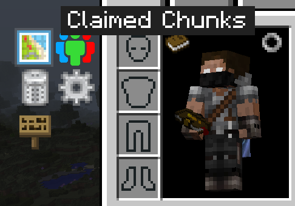

ServerUtilities
===============
ServerUtilities for server owners and daring single players. Backport and Rebrand of the 1.12.2 version of FTBUtilities, FTBLibrary, and Aurora for 1.7.10.

Fully backwards compatible with homes, chunks, and more. These will be imported on first load.

Utilizes a permission system to handle whether a player can use certain commands and do certain things. A full list of permissions along with their description can be found in the Ranks edit gui found in the admin panel or by using `/dump permissions`.

## Dependencies
* [GTNHLib](https://www.curseforge.com/minecraft/mc-mods/gtnhlib)
* Optionally [Navigator](https://github.com/GTNewHorizons/Navigator) which enables claims and chunkload integration for JourneyMap or Xaeros World & Minimap

## Quick Install

Download the latest JAR from [releases](https://github.com/GTNewHorizons/ServerUtilities/releases) - you want the one named ServerUtilities-number.jar, not the `dev` or `sources`. Place it in the `/mods` folder on your server AND client (if single player, on client only).

Once loaded, you will find new UI options in your inventory screen:

For single player, loading chunks is the most important, and you can click that icon and then shift-click (and drag) to designate chunks to load. Right click to unload and unclaim.

The ServerUtilities configuration files are found in `.minecraft/serverutilities` and it will migrate from FTBU for you. The most likely thing you want to change is found in `.minecraft/serverutilities/server/ranks.txt` where you can control how many chunks can be loaded. `.minecraft/serverutilities/serverutilities.cfg` is where you can disable backups if you have another backup solution.

For server admins, there is much more that ServerUtilities can do, refer to the FTBU documentation for now.

### License

GTNH Modifications Copyright (C) 2021-2024 The GTNH Team

GTNH Changes are Dual Licensed: 
For LatvianModder/FTBTeam - Original MIT License 
For everyone else, this code is licensed LGPL v3.0 or later. Feel free to use our changes, just give back any changes you make to the community as well!

Original code Copyright (c) 2016 LatvianModder and licensed MIT (Based on LatMod Discord and the original https://latmod.com/)

### License Support:
* Latvian Modder's statement on mods he worked on, including FTBUtilities:

* [FTB Utilities wayback machine license](https://web.archive.org/web/20190624234434/https://minecraft.curseforge.com/projects/ftb-utilities)

* [FTB Library wayback machine license](https://web.archive.org/web/20190418011645/https://minecraft.curseforge.com/projects/ftblib)

* Aurora License

